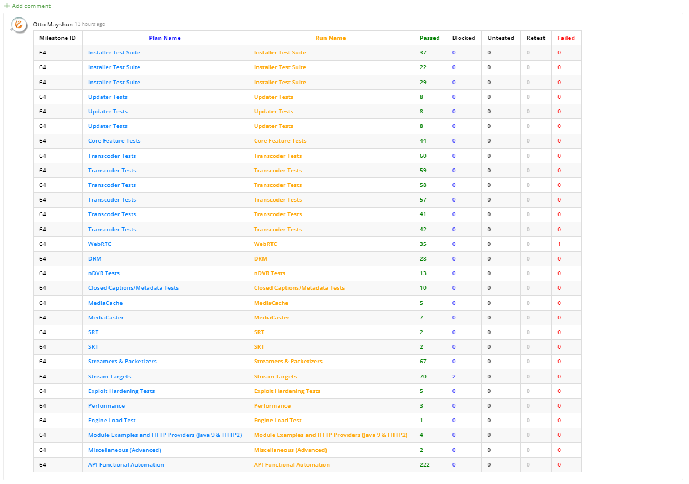
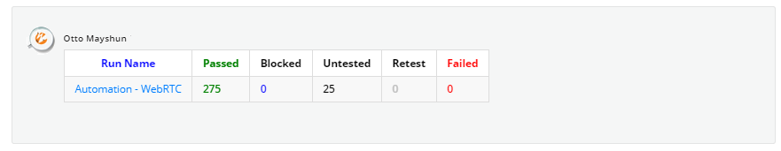

# Testrail to Target Process Integration
--------------------------------------
These scripts  add the ability to push test results to any Target Process User Story, Feature, Release, etc... from the view details screen of any **Test Plan** or **Test Run** in Testrail

##### *test plan integration*

##### *Test run integration*

### Script Details

#### UI Script // Javascript 
Configurable via the **customizations** section of **Administration settings** in Testrail.

* **uiscript_push_plans.js**
* **uiscript_push_runs.js**
* **uiscript_push_milestones.js**

#### PHP Server scripts 

NOTE: you must replace the credentials and base_urls with correct values in each PHP file

* $tp_username = "TP_USERNAME";
* $tp_password = "TP_PASSWORD";
* $tp_base_url = "https://your.tpondemand.com/api/v1/";

* $testrail_username = "TR_USERNAME";
* $testrail_password = "TR_PASSWORD";
* $testrail_pview_url = "https://your-testrail-url/index.php?/plans/view/";
* $testrail_rview_url = "https://your-testrail-url/index.php?/results/view/";

* **In the payload section of each php file**
* "id" => YOUR_ID

These scripts are located on server in **/var/www/html/tetrail/custom/**

* **plan-results.php**
* **run-results.php**
* **milestone-results.php**
